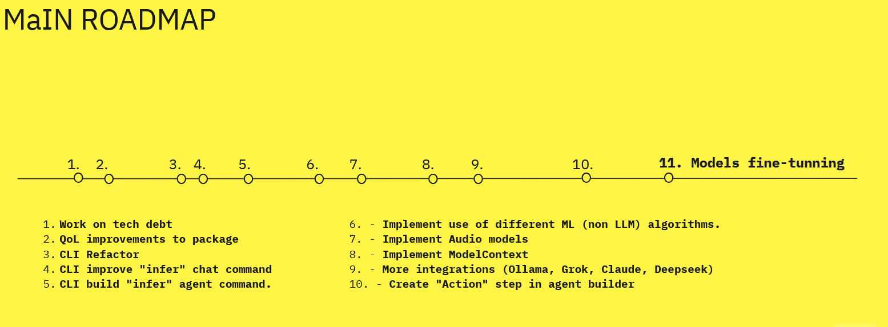

```md


# MaIN Roadmap

Welcome to the **MaIN Roadmap**—a timeless outline of where we’re headed and what we aspire to achieve. We may not have a strict timeline for these items, but we’re fully committed to our vision of building a modular, flexible, and powerful AI framework.

---

## 1. Continuous Work on Tech Debt
Maintaining and improving the package is an ongoing process. We aim to keep the codebase clean, efficient, and up-to-date as the project evolves.

## 2. Quality of Life Improvements
We plan to implement various “nice-to-have” features and enhancements, making MaIN more intuitive, reliable, and user-friendly.

## 3. CLI Refactor
The current CLI (mcli) began as a collection of platform-specific scripts for debugging and development. We’re looking to rewrite it in a dedicated CLI framework (like .NET Spectre) to unify code, improve maintainability, and offer a more polished user experience.

## 4. Expanded `infer` Command
Right now, the `infer` command is limited. Our goal is to incorporate chat history, so users can run inference with full conversational context.

## 5. Agent-Focused `infer` Command
Similar to the chat `infer` functionality, we plan to create an `infer` command for agents, letting you quickly validate and test your own RAG (Retrieval-Augmented Generation) environments.

## 6. Integration of Traditional ML Algorithms
Beyond LLMs, we want MaIN to support a broader range of AI methods—like Linear Regression, KNN, Reinforcement Learning, and other neural or statistical techniques—so agents can tackle a wide variety of tasks.

## 7. Audio Integration
We plan to add audio-to-text and text-to-audio capabilities. This will make MaIN agents more interactive and better suited for real-world applications involving speech recognition and synthesis.

## 8. ModelContext for Better Model Management
While we currently offer `ChatContext`, `AgentContext`, and `FlowContext`, we also aim to introduce a `ModelContext` that simplifies the process of managing models directly from your code.

## 9. Additional Integrations
We’re always on the lookout for new integrations—whether that’s more LLM providers, specialized AI services, or other community-driven features.

## 10. Action Step for Agents
We want to enable agents to perform actions on both the operating system and the internet. This includes built-in actions as well as a developer-friendly interface for creating custom actions.

## 11. Model Fine-Tuning
Finally, we aim to support the creation of fine-tuned model versions directly within .NET, streamlining the process of customizing models to specific domains or tasks.

---

### A Timeless Roadmap
Because MaIN is not a full-time endeavor yet, we can’t commit to specific deadlines. However, our **ambition** drives us forward, and the project exists today thanks to that drive. We hope you’ll join us on this journey—contributions, ideas, and feedback are always welcome.
```